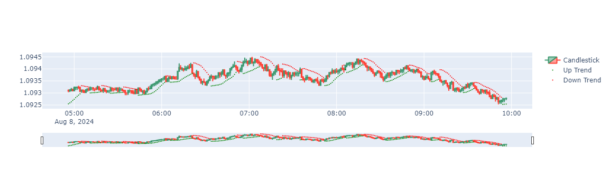
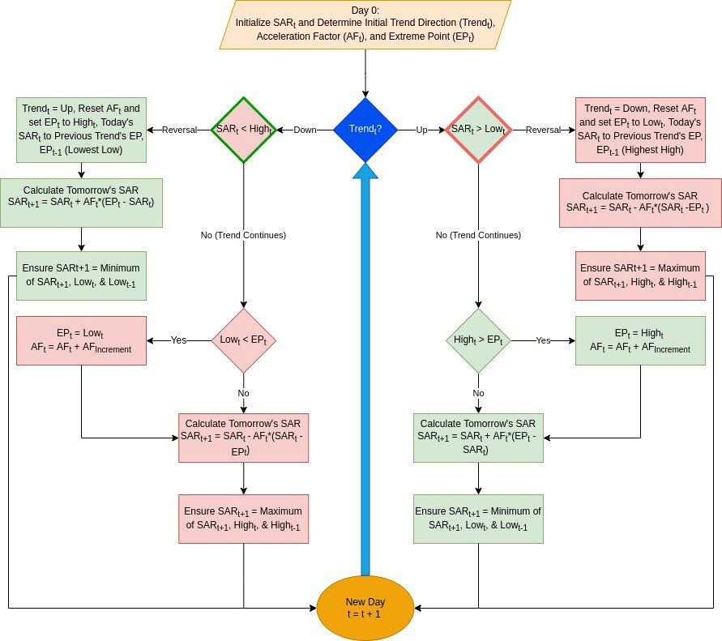

# Parabolic SAR Strategy with Python



This Python script visualizes the Parabolic SAR (PSAR) using both real-time and historical market data.
## Prerequisites

Ensure you have the requirements file installed.

To install the libraries listed in the `requirements.txt` file, use the following command:

```sh
pip install -r requirements.txt
```

## Environment Variables

Create a `.env` file in your project directory and add your `CLIENT_ID` and `CLIENT_SECRET`:

```env
CLIENT_ID=your_client_id
CLIENT_SECRET=your_client_secret
```

These variables enable secure access to market data from the [HSTRADER](https://staging.hstrader.com/login) platform.

**Note:**
Your unique `CLIENT_ID` and `CLIENT_SECRET` can be obtained from your personal account on the platform. Ensure you keep them confidential to protect your data.

### Parabolic SAR

The SAR was devised by famed trader Welles Wilder in his classic 1978 book on trading systems. He came up with it to help manage risk to use as a guide for trailing stop losses so he knew when to get out of positions. Over the years, it has evolved and is also frequently used as an entry/exit signal on its own, or in conjunction with other indicators.

### Components of Parabolic SAR Calculation

1. **Initialization:**
   - Initial Acceleration Factor (AF): Typically set to 0.02.
   - Maximum Acceleration Factor (Max AF): Typically set to 0.2.
   - AF Step: Increment by which AF increases.

2. **Trend Determination:**
   - Uptrend: When prices are consistently rising.
   - Downtrend: When prices are consistently falling.

3. **Extreme Point (EP):**
   - Highest high during an uptrend.
   - Lowest low during a downtrend.

4. **Calculation Steps:**
   Check out the flow chart below to get an overview of the procedure:
   
